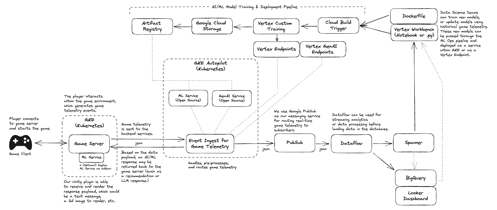

# GenAI Quickstart for Games

This project provides set of quickstarts aimed at accelerating GenAI integration and personalization within of live game enviroments using Google Cloud products and open source gaming solutions.

In today's gaming industry, providing a personalized and engaging experience for players is crucial. This project offers game developers a set of quickstart resources to help them integrate GenAI capabilities into their live game environments. By leveraging Google Cloud products and open-source gaming solutions, you can enhance player engagement, unlock new use cases with Generative AI, and create memorable gaming experiences.

NOTE: This is a rapidly evolving repo and is being adapted for a variety of use cases. If you would like to contribute or notice any bugs, please open an issue and/or feel free to submit a PR for review.

If you’re using this project, please ★Star this repository to show your interest!

## Project Structure

| Folder                        | Description                   |
|-------------------------------|-------------------------------|
| [infra](./infra)              | Infrastructure deployment scripts based on Terraform |
| [quickstarts](./quickstarts)  | Individual quickstarts that can be tested and deployed based on your use case |
| [src](./src)                  | Core source code that is used as part of our quickstarts |


## Architecture 




<br>

## Getting Started

Run the [setup.sh](setup.sh) prior to your deployment. This setup script will check for system dependencies (such as gcloud, terraform, etc), it will set default ENV variables, and enable Google Cloud APIs required for the deployment.

```sh
# Run the setup script
source ./setup.sh
```

To provision the infrastructure, follow the instructions provided at [infra/README.md](./infra/README.md). 

<br>

## Quickstarts

Once the your Google Cloud infrastructure is provision, navigate to the quickstart section that is most relevent for your use case: 

| Quick Start Name                   | Description                        |                                 
|------------------------------------|------------------------------------|
| [Event Ingest](./quickstarts/event_ingest) | This service ingests game telemetry from the game server. It is responsible for accepting and routing the game event traffic. |
| [Spanner](./quickstarts/spanner)       | Spanner is used as our globally scalable ACID compliant database. |
| [GenAI LLM](./quickstarts/genai_llm)             | The GenAI LLM service can be configured to deploy [Google Vertex LLMs](https://cloud.google.com/vertex-ai/docs/generative-ai/learn/overview) for Text, Chat, and Code generation. |
| [GenAI Image Gen with OS](./quickstarts/genai_image_gen_os)           | This service deploys an open source stable diffusion model from [Hugging Face](https://huggingface.co/models?sort=trending&search=stable+diffusion). |
| [Vertex ML Training](./quickstarts/vertex_ml_training)         | This code contains an example model training pipeline using tensorflow and [Vertex AI Custom Training](https://cloud.google.com/vertex-ai/docs/training/overview) |
| [Vertex ML Serving](./quickstarts/vertex_ml_serving)         | This service deploys the ML model that was trained in the previous step (or a Tensorflow model that you provide) |


---

## Contributing

The entire repo can be cloned and used as-is, or in many cases you may choose to fork this repo and keep the code base that is most useful and relevant for your use case. If you'd like to contribute, then more info can be found witin our [contributing guide](./CONTRIBUTING.md).

---

## Licence

Apache 2.0
