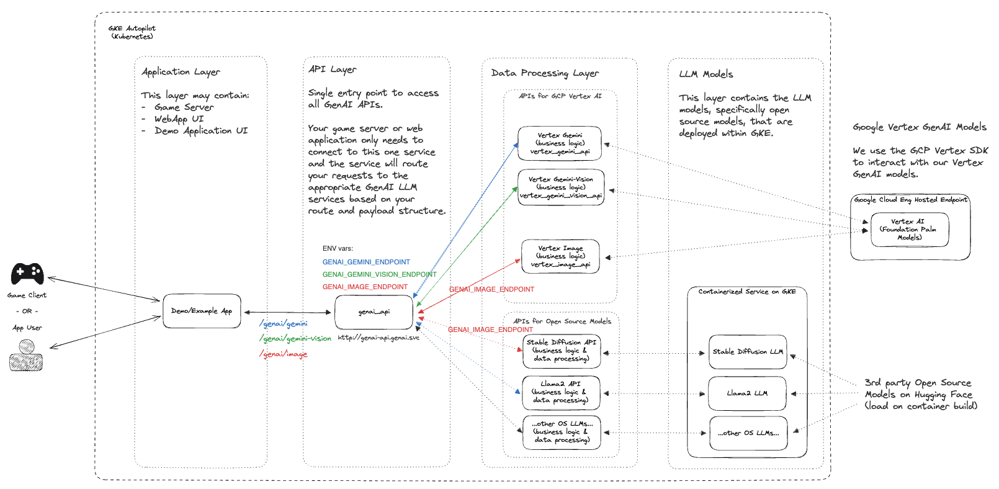

# GenAI Quickstart for Games

This project provides set of quickstarts aimed at accelerating GenAI integration and personalization within of live game enviroments using Google Cloud products and open source gaming solutions.

In today's gaming industry, providing a personalized and engaging experience for players is crucial. This project offers game developers a set of quickstart resources to help them integrate GenAI capabilities into their live game environments. By leveraging Google Cloud products and open-source gaming solutions, you can enhance player engagement, unlock new use cases with Generative AI, and create memorable gaming experiences.

NOTE: This is a rapidly evolving repo and is being adapted for a variety of use cases. If you would like to contribute or notice any bugs, please open an issue and/or feel free to submit a PR for review.

If you’re using this project, please ★Star this repository to show your interest!

## Project Structure

| Folder                        | Description                   |
|-------------------------------|-------------------------------|
| [terraform](./terraform)      | Infrastructure deployment scripts based on Terraform |
| [examples](./examples)        | Individual quickstarts that can be tested and deployed based on your use case |
| [src](./src)                  | Core source code that is used as part of our quickstarts |

## Architecture 



## Prerequisites

- [Terraform](https://www.terraform.io/downloads.html)
- [gcloud](https://cloud.google.com/sdk/docs/install)
- [kubectl](https://kubernetes.io/docs/tasks/tools/install-kubectl/)
- [skaffold](https://skaffold.dev/docs/)

## Getting started

The following steps below will walk you through the setup guide for *GenAI Quickstart*. The process will walk through enabling the proper **Google Cloud APIs**, creating the resources via **Terraform**, and deployment of the **Kubernetes manifests** needed to run the project.

> __Note:__ These steps assume you already have a running project in Google Cloud for which you have IAM permissions to deploy resources into.

### 1) Clone this git repository

```
git clone https://github.com/googleforgames/GenAI-quickstart.git

cd GenAI-quickstart
```

### 2) Set ENV variable

Set your unique Project ID for Google Cloud

```
export PROJECT_ID=$(gcloud config list --format 'value(core.project)' 2>/dev/null)
```

Set default location for Google Cloud

```
export LOCATION=us-west1
```

To better follow along with this quickstart guide, set `CUR_DIR` env variable

```
export CUR_DIR=$(pwd)
```

### 3) Confirm user authentication to Google Cloud project

```
gcloud auth list
```

Check if your authentication is ok and your project_id

```
gcloud projects describe $PROJECT_ID
```

You should see the your `projectId` listed with an `ACTIVE` state.

### 4) Enable Google Cloud APIs

```
gcloud services enable --project $PROJECT_ID \
  aiplatform.googleapis.com \
  artifactregistry.googleapis.com \
  cloudbuild.googleapis.com \
  cloudresourcemanager.googleapis.com \
  compute.googleapis.com \
  container.googleapis.com \
  containerfilesystem.googleapis.com \
  containerregistry.googleapis.com \
  iam.googleapis.com \
  servicecontrol.googleapis.com
```

### 5) Deploy infrastructure with Terraform

```
cd $CUR_DIR/terraform

cat terraform.example.tfvars | sed -e "s:your-unique-project-id:$PROJECT_ID:g" > terraform.tfvars

terraform init

terraform plan

terraform apply
```

The deployment of cloud resources can take between 5 - 10 minutes. For a detailed view of the resources deployed see [README](terraform/README.md) in `terraform` directory.

### 6) Setup GKE credentials

After cloud resources have successfully been deployed with Terraform. Get newly created GKE cluster credentials.

```
gcloud container clusters get-credentials genai-quickstart --zone us-west1-b --project $PROJECT_ID
```

### 7) Deploy GenAI workloads on GKE

Switch to the `genai` directory

```
cd $CUR_DIR/genai
```

Set kubernetes manifests for GenAI workloads to use your unique project id

```
find . -type f -name "*.yaml" -exec sed -i "s:your-unique-project-id:$PROJECT_ID:g" {} +
```

Build and run GenAI workloads with **Skaffold**

```
export SKAFFOLD_DEFAULT_REPO=$LOCATION-docker.pkg.dev/$PROJECT_ID/repo-genai-quickstart

# To run all apis and models (requires a GPU node for stable-diffusion)
skaffold run --build-concurrency=0

# To run only stable-diffusion (requires a GPU node)
#skaffold run --module stable-diffusion-api-cfg,stable-diffusion-endpt-cfg

# To run Vertex chat (Vertex AI is required)
#skaffold run --module vertex-chat-api-cfg
```

### 8) Tests

Access the API - You can test the application and all the APIs from here  :)

```
export EXT_IP=`kubectl -n genai get svc genai-api -o jsonpath='{.status.loadBalancer.ingress.*.ip}'`
echo http://${EXT_IP}/genai_docs
```

Test the API (command line - curl)

```
curl -X 'POST' "http://${EXT_IP}/genai/text" \
  -H 'accept: application/json' \
  -H 'Content-Type: application/json' \
  -d '{"prompt": "Who are the founders of Google?"}'
```

## Project cleanup

In `genai` directory

```
cd $CUR_DIR/genai

skaffold delete
```

In `terraform` directory

```
cd $CUR_DIR/terraform

terraform destroy
```

## Troubleshooting

### Not authenticated with Google Cloud project

If you are not running the above project in Google Cloud shell, make sure you are logged in and authenticated with your desired project:

```
gcloud auth application-default login

gcloud config set project <your-unique-project-id>
```

and follow the authentication flow.


---

## Contributing

The entire repo can be cloned and used as-is, or in many cases you may choose to fork this repo and keep the code base that is most useful and relevant for your use case. If you'd like to contribute, then more info can be found witin our [contributing guide](./CONTRIBUTING.md).


---

## Licence

Apache 2.0

