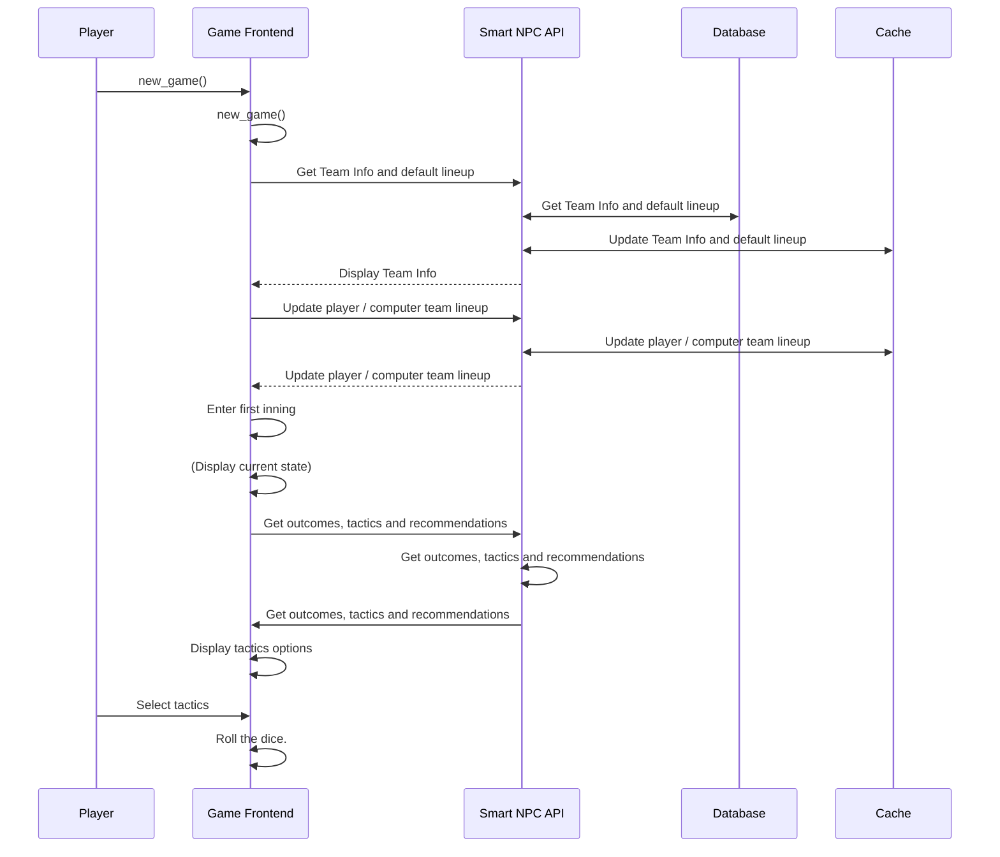

```mermaid
sequenceDiagram

Player ->> Game Frontend: new_game()
Game Frontend ->> Game Frontend: new_game()
Game Frontend ->> Smart NPC API: Get Team Info and default lineup
Smart NPC API <<->> Database: Get Team Info and default lineup
Smart NPC API <<->> Cache: Update Team Info and default lineup
Smart NPC API -->>Game Frontend: Display Team Info
Game Frontend ->> Smart NPC API: Update player / computer team lineup
Smart NPC API <<->> Cache: Update player / computer team lineup
Smart NPC API -->> Game Frontend: Update player / computer team lineup
Game Frontend ->> Game Frontend: Enter first inning

Game Frontend <<->> Game Frontend: (Display current state)
Game Frontend ->> Smart NPC API: Get outcomes, tactics and recommendations
Smart NPC API <<->> Smart NPC API: Get outcomes, tactics and recommendations
Smart NPC API ->> Game Frontend: Get outcomes, tactics and recommendations
Game Frontend <<->> Game Frontend: Display tactics options
Player ->> Game Frontend: Select tactics
Game Frontend <<->> Game Frontend: Roll the dice.

```